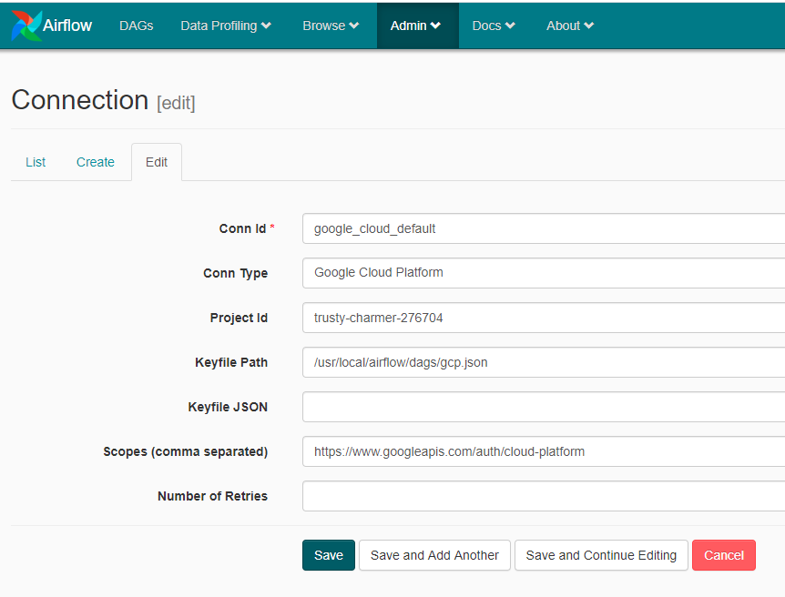
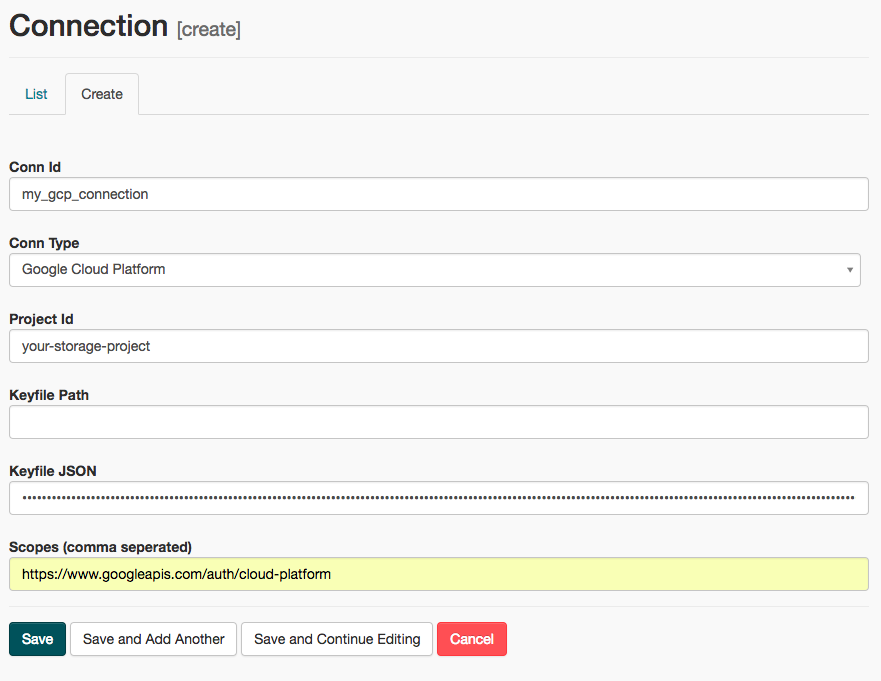
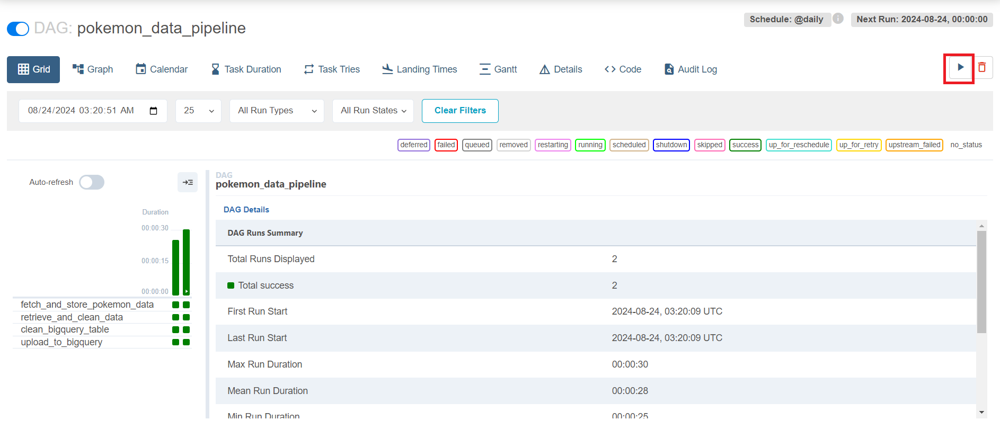

# ETL-Using-AirFlow
This is a simple ETL (Extract, Transform, & Load) using Airflow. Step :
1. Extract dataset from the API 
2. Store the dataset to Google Cloud Storage
3. Retreive the dataset from Google Cloud Storage and clean it
4. Store cleaned dataset to stagging (Google Cloud Storage)
5. Store the final dataset in Google BigQuery

# Prerequisite

## Docker Desktop
Install docker deskto from official docker website
```bash
https://www.docker.com/products/docker-desktop/
```

## Service Account Credentials
Generate key of Service Account on IAM & Admin Google Cloud Console and store it as Connection in Airflow Admin
```Json
{
  "type": "service_account",
  "project_id": "Your Project ID",
  "private_key_id": "Your Private ID",
  "private_key": "Your Private Key",
  "client_email": "Your Client Key",
  "client_id": "Your Client ID",
  "auth_uri": "https://accounts.google.com/o/oauth2/auth",
  "token_uri": "https://oauth2.googleapis.com/token",
  "auth_provider_x509_cert_url": "https://www.googleapis.com/oauth2/v1/certs",
  "client_x509_cert_url": "https://www.googleapis.com/robot/v1/metadata/xxx.iam.gserviceaccount.com",
  "universe_domain": "googleapis.com"
}

```
# Step 
Step by step to use Airflow
1. Clone this repository
2. Install  & Open Docker
3. Install & Open Visual Studio Code
4. Open Docker & Visual Studio Code
5. Create a new file .env and add the following lines
```console
AIRFLOW_IMAGE_NAME=apache/airflow:2.4.2
AIRFLOW_UID=50000
```
6. Build container using this command on command:
```console
docker-compose up -d
```
7. Create Admin user using bellow command:
```console
docker-compose run airflow-worker airflow users create --role Admin --username admin --email admin --firstname admin --lastname admin --password admin
```
8. Login to Airflow on and insert username and password:
```
http://localhost:8080/
```
9. Setting Up Connection, You can create a connection to Google Cloud from Airflow webserver admin menu. In this menu you can pass the Service Account key file path:
 In this picture, the keyfile Path is '/usr/local/airflow/dags/gcp.json.' Beforehand you need to mount your key file as a volume in your Docker container with the previous path. You can also directly copy the key json content in the Airflow connection, in the keyfile Json field :


10. Run the DAG by trigger the button like below picture
 